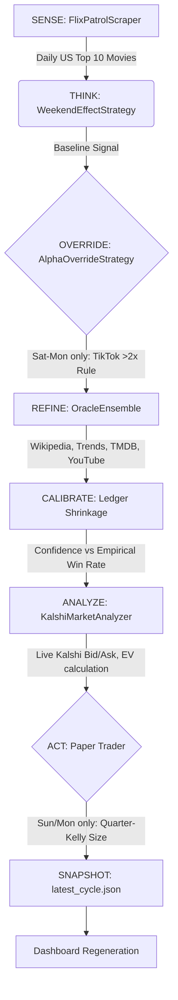
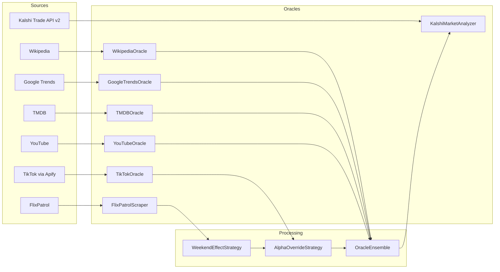

# Architecture: Kalshi Netflix Movies Agent

An autonomous prediction agent for Kalshi Netflix Top-10 **MOVIES** markets ("Will [movie] be the #1 Netflix film this week?"). The core edge is the Weekend Effect: weekend viewership dominates the official weekly chart.

Current status: **Phase 2 — paper trading**. Focus: **MOVIES** category.

---

## System Architecture

The master agent pipeline ([`master_agent.py`](file:///C:/Users/DSU%20Student/Desktop/kalshiAgent-main/master_agent.py)) runs the following sequence:

## Data Flow

---

## File Map

### Entry Points
- [`master_agent.py`](file:///C:/Users/DSU%20Student/Desktop/kalshiAgent-main/master_agent.py) (518 lines) — Live orchestration: sense→think→override→refine→calibrate→analyze→act→snapshot. CLI commands: `run`, `resolve`, `status`, `markets`, `dashboard`. Contains `MasterAgent` class with `run_cycle()`, `resolve()`, `_write_snapshot()`, `_persist_rankings()`, `_latest_top_contenders()`. Focuses on Films category.
- [`run_backtest.py`](file:///C:/Users/DSU%20Student/Desktop/kalshiAgent-main/run_backtest.py) — Backtest CLI: modes `sample`, `backtest`, `analyze`, `paper`.
- [`dashboard.py`](file:///C:/Users/DSU%20Student/Desktop/kalshiAgent-main/dashboard.py) — Generates self-contained HTML dashboard from `data/latest_cycle.json`.
- [`whale_tracker.py`](file:///C:/Users/DSU%20Student/Desktop/kalshiAgent-main/whale_tracker.py) (67 lines) — CLI to track large trades on Kalshi markets. Usage: `python whale_tracker.py <ticker> --threshold 100 --limit 500`.

### Core Library (`src/`)
- [`config.py`](file:///C:/Users/DSU%20Student/Desktop/kalshiAgent-main/src/config.py) (223 lines) — ALL tuneable parameters. Key sections:
  - **Paths**: `PROJECT_ROOT`, `DATA_DIR`, `RAW_DIR`, `PROCESSED_DIR`, `SAMPLE_DIR`
  - **FlixPatrol**: `FLIXPATROL_BASE_URL`, `FLIXPATROL_COUNTRIES` (world, united-states), rate limits
  - **Netflix**: `NETFLIX_TOP10_URL`, `NETFLIX_CSV_URL` (all-weeks-countries.tsv), `NETFLIX_CSV_COLUMNS`
  - **Kalshi**: API base, key ID, private key path, series tickers (KXNETFLIXMOVIE etc.), min edge (0.05), fee rate (0.07), title match threshold (0.60), Kelly fraction (0.25)
  - **Trading calendar**: `TRADE_DAYS` = {Sun, Mon}, `TIKTOK_DAYS` = {Sat, Sun, Mon}
  - **TikTok/Apify**: actor, results per page (100), proxy country (US), call timeout (300s), max contenders (3), weekly window, min weekly videos (5), alpha override multiplier (2.0), override confidence (0.85)
  - **Advanced oracles**: Wikipedia, Google Trends, TMDB, YouTube
  - **Ensemble**: dominance ratio (2.0), boost (0.05), penalty (0.05), fresh release days (3), confidence floor (0.05), ceiling (0.95)
  - **Calibration**: min samples (8), bucket width (0.15), prior weight (10.0)

- [`data_collector.py`](file:///C:/Users/DSU%20Student/Desktop/kalshiAgent-main/src/data_collector.py) (1432 lines) — ALL data collection. Classes:
  - `FlixPatrolScraper`: `scrape_daily_top10()`, `scrape_date_range()`, `save_to_csv()`, `load_from_csv()`. Parses HTML tables/lists. Rate-limited.
  - `TikTokOracle`: `get_tiktok_volume()`, `get_volumes_for_contenders()`. Uses Apify clockworks/tiktok-scraper. Weekly velocity filter (only videos posted this Netflix week). In-memory cache.
  - `WikipediaOracle`: `get_pageviews()`. Resolves title to article via MediaWiki search, sums daily pageviews over lookback window. Keyless.
  - `GoogleTrendsOracle`: `get_interest()`. Via pytrends, 7-day US interest. Compares up to 5 titles together. Keyless.
  - `TMDBOracle`: `get_metadata()`. Returns `runtime_min`, `release_date`, `popularity`, `cast`, `director`. Requires `TMDB_API_KEY`. Always searches as movie (`media_type='movie'`).
  - `YouTubeOracle`: `get_trailer_velocity()`. Searches "<title> official trailer", returns views, views_per_day, published_at. Requires `YOUTUBE_API_KEY`.
  - `NetflixTop10Collector`: `download_weekly_csv()`, `load_weekly_data()`, `filter_us_data()`, `get_weekly_number_one()`. Downloads all-weeks-countries.tsv.
  - `DataMerger`: `merge_daily_and_weekly()`, `compute_weekend_features()`. Engineers features: weekend_rank_avg, weekday_rank_avg, weekend_dominance_score, days_at_number_one, weekend_days_at_one.
  - `normalize_title_to_hashtag()`: Netflix title → TikTok hashtag cleaner
  - `generate_sample_data()`: Creates 52 weeks of realistic synthetic data.

- [`strategy.py`](file:///C:/Users/DSU%20Student/Desktop/kalshiAgent-main/src/strategy.py) (721 lines) — Signal generation. Classes:
  - `Signal`: dataclass with `predicted_winner`, `confidence`, `signal_strength` (strong/medium/weak), `reasoning`, `week`, `category`.
  - `WeekendEffectStrategy`: `generate_signal()`. Base confidence: both weekend days + not dominated weekdays = 0.82; both + dominated = 0.65; one weekend day = 0.55; else = 0.40. Boosters: new release (+0.10), rising rank (+0.05), large weekend gap (+0.05).
  - `AlphaOverrideStrategy`: `apply()`. If trailing contender has >2x TikTok views of #1, override prediction at 0.85 confidence. Fail-safe.
  - `OracleEnsemble`: `apply()`. Wikipedia, Google Trends, TMDB release velocity, YouTube trailer velocity. Each ±0.05 max. Dominance ratio = 2.0x.
  - `KalshiSimulator`: `simulate_market_price()`, `calculate_position_size()` (fractional Kelly), `calculate_pnl()`.

- [`kalshi_client.py`](file:///C:/Users/DSU%20Student/Desktop/kalshiAgent-main/src/kalshi_client.py) (629 lines) — Kalshi API. Classes:
  - `KalshiClient`: HTTP wrapper. Public endpoints (no auth): `get_events()`, `get_event()`, `get_markets()`, `get_market()`, `get_orderbook()`, `get_trades()`. Auth endpoints (RSA-PSS signing): `get_balance()`, `get_positions()`. Retry logic, rate limit handling (429).
  - `KalshiMarketAnalyzer`: `find_netflix_event()` with 3-stage discovery (known series → cache → scan). `analyze()` produces `MarketAnalysis` with quotes, winner analysis (YES side), fade analysis (NO side), `best_side` selection.
  - `MarketQuote`: dataclass with ticker, market_title, matched_contender, match_score, yes_bid, yes_ask, last_price, implied_prob, spread, volume, open_interest, top_5_bets.
  - `MarketAnalysis`: dataclass with full analysis including both YES and NO side metrics.
  - `normalize_title()`, `title_similarity()`: fuzzy matching for FlixPatrol↔Kalshi title alignment.

- [`paper_trader.py`](file:///C:/Users/DSU%20Student/Desktop/kalshiAgent-main/src/paper_trader.py) (295 lines) — JSON ledger:
  - `PaperTrader`: `record_signal()`, `record_outcome()`, `get_calibrated_confidence()`, `get_open_positions()`, `get_trade_history()`, `get_performance_summary()`. Fractional Kelly sizing. Handles both YES and NO side trades.

- [`analyzer.py`](file:///C:/Users/DSU%20Student/Desktop/kalshiAgent-main/src/analyzer.py) — Statistical analysis & Monte Carlo simulation.
- [`backtester.py`](file:///C:/Users/DSU%20Student/Desktop/kalshiAgent-main/src/backtester.py) — Core backtesting engine.
- [`visualizer.py`](file:///C:/Users/DSU%20Student/Desktop/kalshiAgent-main/src/visualizer.py) — matplotlib/seaborn plots.

### Data Files
- `data/daily_rankings.csv` (168KB) — Archived FlixPatrol daily scrapes, deduplicated
- `data/netflix_weekly.csv` (27MB) — Official Netflix weekly data (all-weeks-countries.tsv)
- `data/paper_trades.json` — **THE track record (critical file, never lose)**
- `data/latest_cycle.json` — Snapshot of latest agent cycle (dashboard source)
- `data/kalshi_event_cache.json` — Cached series tickers for fast event discovery

### Config & CI
- `.env` / `.env.example` — API keys (`APIFY_API_TOKEN`, `KALSHI_API_KEY_ID`, `KALSHI_PRIVATE_KEY_PATH`, `TMDB_API_KEY`, `YOUTUBE_API_KEY`)
- `.github/workflows/daily_agent.yml` — Runs both categories daily at 21:00 UTC, commits data back

---

## Trading Calendar

| Day | Action | Details |
|---|---|---|
| Tuesday-Friday | SENSE | Capture daily data, generate baseline, take snapshot. No TikTok. No trades. |
| Saturday | WARM UP | TikTok oracle activates. |
| Sunday-Monday | DECISION | Full pipeline. Act on trades if edge ≥ 5% and EV > 0. Market closes Mon 11:59 PM ET. |
| Tuesday | RESOLUTION | Resolve paper trades using Netflix official Top 10 release. |

## Key Design Patterns
- **Fail-safe integration:** Every oracle returns `None` on failure, allowing the agent to fall back gracefully to the baseline signal.
- **In-memory caching:** All oracles cache results to prevent redundant API calls during a single run.
- **Bounded adjustments:** No single oracle in the ensemble can swing confidence by more than `±0.05` to prevent overfitting.
- **Calendar gating:** Prevents wasteful API spend on days when actionable trades cannot be executed.
- **Quarter-Kelly Sizing:** Bet sizing is capped at 25% of the Kelly Criterion output to account for estimation uncertainty.
