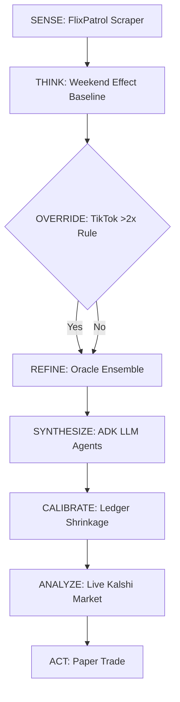

# Pipeline and Strategy: Kalshi Netflix Movies Agent

This documents the complete prediction pipeline, signal generation, trading logic, and market mechanics for the Kalshi Netflix MOVIES prediction agent.

---

## 1. The Weekend Effect Hypothesis (for Movies)

Shows and movies that dominate Netflix viewership on weekends (Saturday and Sunday) tend to top the official weekly chart. Casual viewers binge on weekends. Two high-volume weekend days can outweigh five moderate weekdays. The market often anchors on mid-week FlixPatrol rankings, underweighting the weekend surge. Our edge comes from identifying these weekend dominators before the market prices them correctly.

## 2. Kalshi Market Mechanics (Movies)

- Markets resolve based on the Netflix official US Top 10 (`top10.netflix.com`), published every Tuesday.
- Movie-specific series tickers: `KXNETFLIXMOVIE`, `KXNETFLIXRANKMOVIE`, `KXTOPNETFLIXMOVIE`
- Contracts close at 11:59 PM ET on Monday.
- Each contract is priced $0.00-$1.00 (price = implied probability).
- Binary payoff: pays $1 if correct, $0 if not.
- Taker fee: 7% * P * (1-P) per contract (max 1.75¢).

---

## 3. Signal Generation Pipeline

### Step 1: SENSE — FlixPatrol Scraping
- Scrapes daily US Top 10 movies from FlixPatrol for the current Netflix week (Monday → today).
- Filters to Films category only.
- Archives all scrapes to `data/daily_rankings.csv` (deduplicated).
- **Code**: `MasterAgent.run_cycle()` lines 122-136 in [`master_agent.py`](file:///C:/Users/DSU%20Student/Desktop/kalshiAgent-main/master_agent.py).

### Step 2: THINK — Weekend Effect Baseline Signal
- Identifies which movie held #1 on Saturday and Sunday.
- **Base confidence rules**:
  - Both weekend days #1 AND not dominated weekdays (≤3 days): **0.82**
  - Both weekend days #1 AND dominated weekdays (>3 days): **0.65**
  - One weekend day #1: **0.55**
  - No clear winner: **0.40**
- **Confidence boosters**:
  - New release (`cumulative_weeks_in_top_10` ≤ 2): **+0.10**
  - Rising rank over the week: **+0.05**
  - Large gap vs #2 on weekends (≥ 2 rank positions): **+0.05**
- Max confidence after boosters: `0.99`
- **Code**: `WeekendEffectStrategy.generate_signal()` in [`src/strategy.py`](file:///C:/Users/DSU%20Student/Desktop/kalshiAgent-main/src/strategy.py) lines 85-221.

### Step 3: OVERRIDE — TikTok >2x Rule
- Only runs on Sat-Mon (`TIKTOK_DAYS`).
- Queries TikTok hashtag volumes for top 3 contenders via Apify.
- If a trailing contender (#2 or #3) has >2x the weekly TikTok views of #1:
  - Override prediction to the challenger.
  - Set confidence to **0.85** (`ALPHA_OVERRIDE_CONFIDENCE`).
- Any `None` volume (API failure, no videos) disables override for that comparison.
- **Code**: `AlphaOverrideStrategy.apply()` in [`src/strategy.py`](file:///C:/Users/DSU%20Student/Desktop/kalshiAgent-main/src/strategy.py) lines 302-373.

### Step 4: REFINE — Oracle Ensemble
- Runs after baseline + override.
- Each oracle provides a **±0.05 max adjustment**.
- **Wikipedia**: winner >2x all rivals' pageviews → +0.05; rival >2x winner → -0.05
- **Google Trends**: same dominance logic on 7-day US interest.
- **TMDB**: movie premiered within first 3 days of Netflix week and already tops chart → +0.05 (explosive velocity).
- **YouTube**: winner's trailer views_per_day >2x rivals → +0.05; rival >2x → -0.05
- Dominance ratio for all: **2.0x** (`ENSEMBLE_DOMINANCE_RATIO`).
- Final confidence clamped to `[0.05, 0.95]`.
- **Code**: `OracleEnsemble.apply()` in [`src/strategy.py`](file:///C:/Users/DSU%20Student/Desktop/kalshiAgent-main/src/strategy.py) lines 426-490.

### Step 5: SYNTHESIZE — ADK LLM Agents
- Evaluates the final ensemble output against live web data.
- **Netflix Promo Scout**: Runs a web search over Netflix Tudum and weekend news to find heavily promoted movies, returning a JSON array of `promo_score` objects.
- **Kalshi Predictor**: Uses Gemini 3.1 Pro to digest the full JSON payload (FlixPatrol, Oracle data, and Promo data) and makes the final prediction decision.
- Returns a strict JSON payload with the final `predicted_winner` and `confidence` score.
- **Code**: `run_llm_prediction()` in [`src/llm_agent.py`](file:///C:/Users/DSU%20Student/Desktop/kalshiAgent-main/src/llm_agent.py) and `fetch_promoted_movies()` in [`src/promo_agent.py`](file:///C:/Users/DSU%20Student/Desktop/kalshiAgent-main/src/promo_agent.py).

### Step 6: CALIBRATE — Ledger-Based Shrinkage
- Looks at resolved trades with similar confidence (within ±0.15).
- Needs ≥8 resolved trades in the bucket.
- Blends: `(empirical_win_rate * N + raw_confidence * 10) / (N + 10)`
- **Code**: `PaperTrader.get_calibrated_confidence()` in [`src/paper_trader.py`](file:///C:/Users/DSU%20Student/Desktop/kalshiAgent-main/src/paper_trader.py) lines 173-194.

### Step 7: ANALYZE — Live Kalshi Market Analysis
- Discovers Netflix movie event (3-stage: known series → cache → scan).
- Fuzzy-matches FlixPatrol movie titles to Kalshi market outcomes (threshold: `0.60`).
- **Computes for YES side** (buy YES on predicted winner at ask):
  - `edge = our_prob - ask`
  - `fee = 0.07 * price * (1-price)`
  - `EV = edge - fee`
  - Quarter-Kelly sizing
- **Computes for NO side** (fade overpriced market favorite):
  - `P(favorite loses) ≥ our_prob` (conservative lower bound)
  - `NO cost = 1 - yes_bid`
  - Same edge/fee/EV/Kelly calculation
- Picks `best_side` by highest EV.
- **Tradeable** = best side clears min edge (`0.05`) AND EV > 0.
- **Code**: `KalshiMarketAnalyzer.analyze()` in [`src/kalshi_client.py`](file:///C:/Users/DSU%20Student/Desktop/kalshiAgent-main/src/kalshi_client.py) lines 377-599.

### Step 8: ACT — Paper Trade Recording
- Only runs on decision days (Sun/Mon) — `TRADE_DAYS = {6, 0}`.
- Only when tradeable (edge + EV gates) or `--force`.
- Quarter-Kelly position sizing (`KELLY_FRACTION = 0.25`).
- Records to `data/paper_trades.json`.
- Stores: side (yes/no), target_title, confidence, entry_price, entry_source, edge, ticker, reasoning.
- **Code**: [`master_agent.py`](file:///C:/Users/DSU%20Student/Desktop/kalshiAgent-main/master_agent.py) lines 237-285.

### Step 9: SNAPSHOT
- Writes `data/latest_cycle.json` with all pipeline data.
- Regenerates `output/dashboard.html`.

---

## 4. Trade Resolution

- **Manual command**: `python master_agent.py resolve "<actual winner>"`
- Settles all open trades against the official weekly winner.
- **YES trades** win when the target movie actually won.
- **NO trades** win when the target movie did NOT win.
- **PnL**: 
  - Win = `contracts * (1 - price)`
  - Loss = `-contracts * price`
- Updates bankroll in `data/paper_trades.json`.

---

## 5. Trading Calendar

| Day | Status | Details |
|---|---|---|
| Tuesday-Friday | Capture Only | Scrape daily data, generate baseline, take snapshot. No TikTok overrides, no trades placed. |
| Saturday | Warm Up | TikTok oracle activates for alpha override. Still no trades. |
| Sunday-Monday | Decision Days | Full pipeline. Act on trades if edge ≥ 5% and EV > 0. Market closes Monday 11:59 PM ET. |
| Tuesday | Resolution | Netflix official Top 10 releases. Agent resolves open trades. |

---

## 6. Position Sizing (Kelly Criterion)

- **Full Kelly**: `f* = (bp - q) / b` 
  - Where `b = (1-price)/price`, `q = 1-p`
- **Quarter Kelly**: `f* × 0.25`
- **Max position**: 100 contracts (`KALSHI_MAX_POSITION`)
- **Starting bankroll**: $100 (`KALSHI_BANKROLL`)

---

## 7. Key Design Patterns

- **Fail-safe**: Every oracle returns `None` on failure, and the agent falls back rather than crashing.
- **Caching**: All oracles use in-memory caches to prevent rate-limiting or extra costs within a single cycle.
- **Bounded adjustments**: No single oracle can swing confidence by more than `±0.05`.
- **Calendar gating**: Prevents wasteful API spend on non-actionable days.
